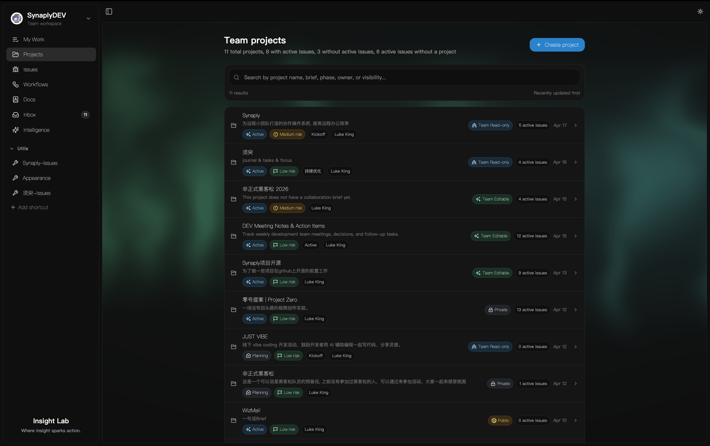

<p align="center">
  
</p>

<h1 align="center">Synaply</h1>

<p align="center">
  소규모 스타트업 팀을 위한 원격 협업 소프트웨어.
</p>

<p align="center">
  <a href="../README.md">English</a> ·
  <a href="./README.zh-CN.md">简体中文</a> ·
  <a href="./README.ko.md">한국어</a> ·
  <a href="./README.ja.md">日本語</a>
</p>

<p align="center">
  
  
  
  
  
  
  
</p>

## 프로젝트 소개

<p align="center">
  
</p>

Synaply는 소규모 스타트업 팀이 더 빠르게 원격 협업할 수 있도록 돕는 소프트웨어입니다. 목표는 단순히 더 많은 작업을 관리하게 만드는 것이 아니라, 프로젝트, 이슈, 워크플로, 문서, 인박스 업데이트를 하나의 실행 맥락으로 연결해 불필요한 확인을 줄이고 인계와 진행을 더 명확하게 만드는 것입니다.

이 제품은 범용 프로젝트 관리 제품군이 아니라, 일을 더 적은 마찰과 더 높은 명확성으로 전달까지 밀어주는 데 초점을 둔 제품입니다.

## 왜 Synaply인가

원격 팀이 막히는 이유는 보통 작업을 만들지 못해서가 아닙니다. 문제는 다음과 같습니다.

- 인계 책임이 불분명하다
- 블로커가 잘 보이지 않는다
- 의사결정 맥락이 흩어진다
- 지금 무엇을 처리해야 하는지 명확하지 않다

Synaply는 이런 순간을 구조화하려고 합니다.

- `Project`로 범위와 방향을 정의합니다
- `Issue`로 실행 가능한 작업을 담습니다
- `Workflow`로 진행과 인계를 드러냅니다
- `Doc`으로 맥락과 결정을 남깁니다
- `Inbox`로 변화와 다음 행동을 모읍니다

## 핵심 모델

Synaply의 핵심 체인은 다음과 같습니다.

`Project -> Issue -> Workflow -> Doc -> Inbox`

이 체인은 제품의 중심축입니다. 새로운 기능은 이 흐름을 강화해야 하며, 제품을 내장 채팅, 무거운 계획 도구, 엔터프라이즈 워크플로 자동화로 끌고 가서는 안 됩니다.

## Synaply가 포함하는 것

- 팀 실행을 위한 프로젝트 및 워크스페이스 구조
- 담당자, 우선순위, 워크플로 상태를 갖춘 이슈 관리
- 시각적인 워크플로 편집과 단계 오케스트레이션
- 별도 사일로가 아닌 실행 객체에 붙어 있는 문서 시스템
- 비동기 조율을 위한 인박스 및 액티비티 화면
- 보조 워크플로를 위한 AI 실행 및 AI 스레드 모듈
- 협업 루프를 둘러싼 Team, Comment, Calendar, Task 모듈
- 국제화 라우트와 다국어 제품 화면

## 아키텍처

Synaply는 단일 저장소 pnpm workspace 모노레포로 구성됩니다.

- [`apps/frontend`](../apps/frontend): Next.js 애플리케이션
- [`apps/backend`](../apps/backend): NestJS API 서비스
- [`supabase`](../supabase): 로컬 Supabase 설정, 마이그레이션, 시드 데이터

큰 그림에서 각 역할은 다음과 같습니다.

- 프런트엔드는 제품 UI, 클라이언트 상태, 문서 편집, 워크플로 시각화, 다국어 라우트를 담당합니다.
- 백엔드는 프로젝트, 이슈, 워크플로, 문서, 인박스, 인증, AI 실행 등의 도메인 API를 제공합니다.
- Supabase는 인증과 PostgreSQL 기반 로컬 개발 인프라를 제공합니다.

## 기술 스택

### 제품 및 플랫폼

- Frontend: Next.js 15, React 19, TypeScript
- Backend: NestJS 10, REST APIs, Swagger
- Database: PostgreSQL
- Auth and local infra: Supabase
- ORM: Prisma 7

### UI 및 클라이언트 경험

- Tailwind CSS 4
- Radix UI primitives
- shadcn/ui 스타일 컴포넌트 아키텍처
- Framer Motion
- Sonner
- next-intl

### 협업 및 편집

- 풍부한 문서 편집을 위한 BlockNote
- 워크플로 시각화를 위한 React Flow
- 협업 및 로컬 우선 편집을 위한 Yjs, `y-websocket`, `y-indexeddb`
- 상호작용 패턴을 위한 `@dnd-kit/react`

### AI 및 데이터 레이어

- Anthropic 호환 커스텀 AI 런타임
- TanStack Query
- Zustand
- Dexie

## 주요 오픈소스 라이브러리

코드베이스에서 눈에 띄는 주요 오픈소스 의존성은 다음과 같습니다.

- `next`, `react`, `typescript`
- `@nestjs/*`
- `@prisma/client`, `prisma`
- `@supabase/supabase-js`, `@supabase/ssr`
- `@blocknote/core`, `@blocknote/react`, `@blocknote/mantine`
- `reactflow`
- `next-intl`
- `framer-motion`
- `@tanstack/react-query`
- `zustand`, `dexie`
- `@radix-ui/react-*`

## 빠른 시작

### 사전 요구 사항

- Node.js 20.19+ 또는 22.12+
- pnpm
- Supabase CLI

### 1. 저장소 클론

```bash
git clone <your-repo-url>
cd Synaply
```

### 2. 로컬 Supabase 스택 시작

저장소 루트에서 실행합니다.

```bash
supabase start
```

이 프로젝트는 로컬 Supabase 설정, 마이그레이션, 시드 데이터를 [`supabase`](../supabase) 아래에 이미 포함하고 있습니다.

### 3. 환경 변수 설정

백엔드:

```bash
cp apps/backend/.env.example apps/backend/.env
```

프런트엔드:

```bash
cp apps/frontend/.env.example apps/frontend/.env.local
```

중요한 값은 다음과 같습니다.

- Backend uses `PORT`, `CORS_ORIGINS`, `DATABASE_URL`, `SUPABASE_URL`, `JWT_SECRET`
- Frontend uses `NEXT_PUBLIC_SUPABASE_URL`, `NEXT_PUBLIC_SUPABASE_ANON_KEY`, `NEXT_PUBLIC_BACKEND_URL`
- AI 관련 프런트엔드 서버 환경 변수로는 `LLM_BASE_URL`, `LLM_MODEL`, `LLM_API_KEY`, 또는 `ANTHROPIC_API_KEY`를 사용할 수 있습니다.

### 4. 의존성 설치

저장소 루트에서 전체 workspace 의존성을 한 번에 설치합니다.

```bash
pnpm install
```

### 5. 서비스 실행

백엔드, 첫 번째 터미널:

```bash
pnpm dev:backend
```

프런트엔드, 두 번째 터미널:

```bash
pnpm dev:frontend
```

### 6. 로컬 앱 열기

- Frontend: [http://localhost:3000](http://localhost:3000)
- Backend health: [http://localhost:5678/health](http://localhost:5678/health)
- Backend Swagger: [http://localhost:5678/api](http://localhost:5678/api)
- Supabase Studio: [http://127.0.0.1:54323](http://127.0.0.1:54323)

## 저장소 구조

```text
Synaply/
├── supabase/             # 로컬 Supabase 설정, 마이그레이션, 시드 데이터
├── apps/backend/      # NestJS 백엔드 서비스
├── apps/frontend/     # Next.js 프런트엔드 애플리케이션
├── DEPLOYMENT.md         # 배포 노트
├── AGENTS.md             # 제품 및 에이전트 지침
└── notes/                # 제품 및 기획 노트
```

## API 및 개발 진입점

- REST health check: `GET /health`
- Swagger docs: `/api`
- 프런트엔드 국제화 앱 라우트는 [`apps/frontend/src/app/[locale]`](../apps/frontend/src/app/%5Blocale%5D) 아래에 있습니다.

## 배포

자세한 배포 및 로컬 실행 안내는 [`DEPLOYMENT.md`](../DEPLOYMENT.md)를 참고하세요.

Synaply를 GitHub에 공개 릴리스할 준비를 하고 있다면 [`OPEN_SOURCE_READINESS.md`](../OPEN_SOURCE_READINESS.md)도 함께 확인하세요.

## 프로젝트 상태

Synaply는 현재 활발히 개발 중입니다. 저장소에는 이미 주요 제품 구성 요소가 들어 있지만, README는 모든 워크플로가 확정되었다는 선언보다는 제품 지도로 읽는 편이 맞습니다.

현재 가장 중요한 제품 방향은 다음과 같습니다.

- `Project -> Issue -> Workflow -> Doc -> Inbox` 체인을 강화하기
- 인계와 블로커를 더 명시적으로 만들기
- 제품을 채팅 중심 도구로 만들지 않으면서 팀의 비동기 가시성을 높이기

## 기여

기여, 이슈, 그리고 제품에 집중된 피드백을 환영합니다.

기여 워크플로와 기대 사항은 [`CONTRIBUTING.md`](../CONTRIBUTING.md)를 참고하세요.

기여를 계획한다면 다음과 같은 개선을 우선 고려해 주세요.

- 역할 간 인계를 더 명확하게 만들기
- 원격 협업에서 반복되는 상태 확인과 추적을 줄이기
- 프로젝트, 이슈, 워크플로, 문서 사이의 공유 맥락을 더 강하게 연결하기

핵심 협업 루프가 충분히 탄탄해지기 전에는 Synaply를 거대한 관리 제품군으로 넓히지 않는 것이 좋습니다.

## 라이선스

Synaply는 [`Elastic License 2.0`](../LICENSE)으로 배포됩니다.

즉, 저장소는 공개되어 있고 소스 사용이 가능하지만, OSI 승인 오픈소스 프로젝트로 표현해서는 안 됩니다.

ELv2 하에서는 내부 사용, 수정, 재배포가 허용됩니다. 다만 Synaply 자체를 호스팅 서비스 또는 관리형 서비스로 제공하려면 ELv2를 넘어서는 별도의 권한이 필요하며, 이는 상업용 라이선스로 다루는 것을 전제로 합니다.

보안 이슈 제보 방법은 [`SECURITY.md`](../SECURITY.md)를 참고하세요.
